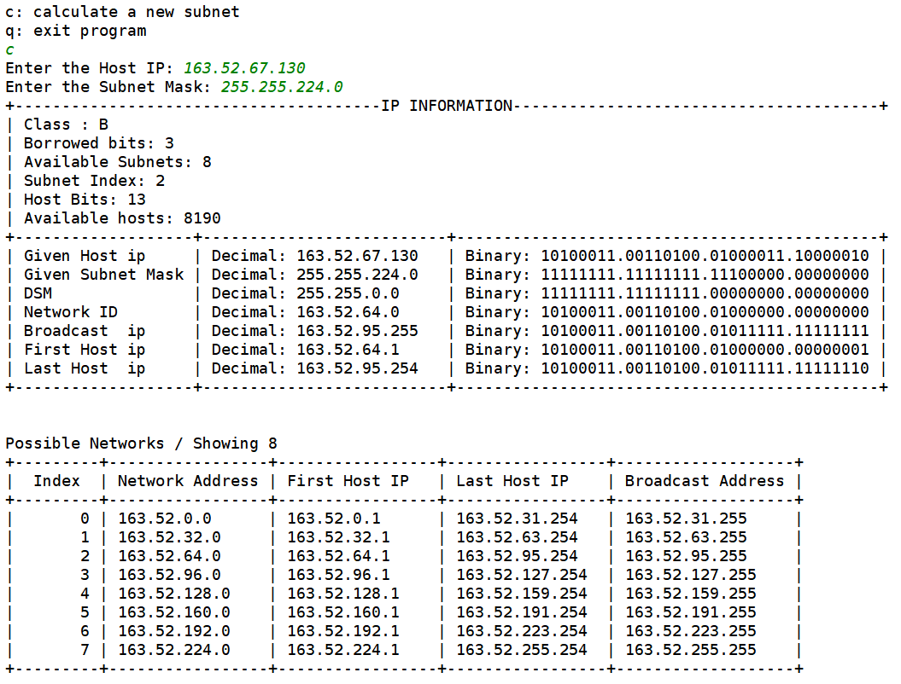

# Subnet calculator
Calculates the following information from a given IPv4 and Mask Address:
* IP Class
* Borrowed Bits
* Available Subnets
* Subnet Index
* Host Bits
* Available Hosts

Also displays the following information both on binary and decimal notation
* Default Network Mask
* Network ID
* Broadcast IP
* First Host IP
* Last Host IP

Also displays a table with all the possible networks using decimal notation
* Index
* Network Address
* First Host Ip
* Last Host IP
* Broadcast Address

# Requirements
* Python 3.6
* IpCalculator.py, Menu.py, SubnetCalculator.py, SubnetListCalculator.py on the same folder

# How to execute
* Run Menu.py
* Type "c" to calculate a new subnet, then enter the Host IP then the mask IP in decimal IPv4 Format.
* Sample Input / Output

# What I learned
* IPv4 Addressing
* How to calculate subnet information
* Array manipulation in python
